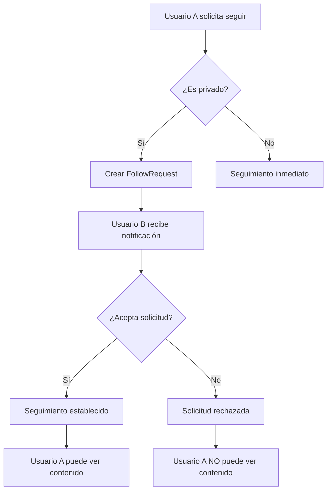
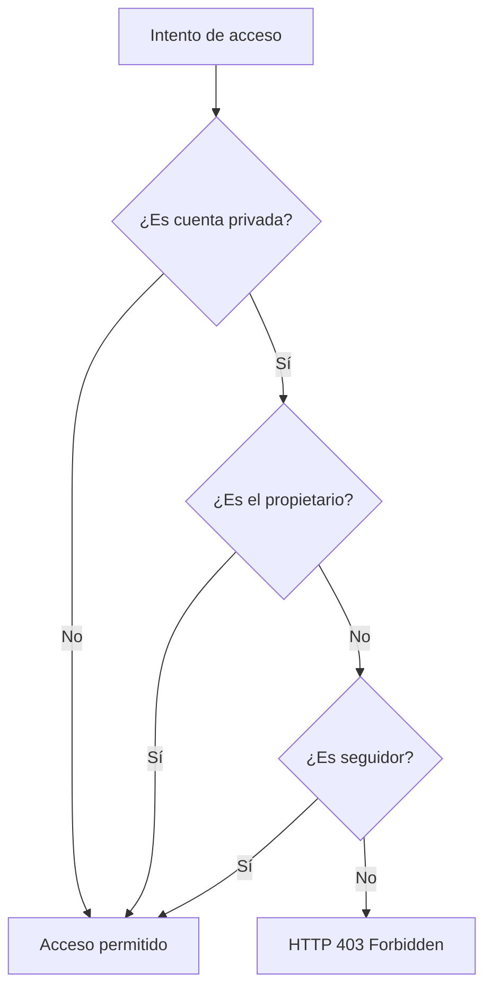

# Lógica de Perfiles Privados - Red Social

## Descripción General

El sistema de perfiles privados permite a los usuarios controlar quién puede ver su contenido y perfil. Un usuario puede establecer su cuenta como privada, limitando el acceso a sus publicaciones, comentarios y información del perfil solo a usuarios autorizados.

## Configuración de la Entidad User

```java
@Column(name = "is_private", nullable = false, columnDefinition = "boolean not null default false")
private boolean isPrivate = false;
```

- **Valor por defecto**: `false` (cuenta pública)
- **Campo de base de datos**: `is_private`
- **Tipo**: Boolean

## Endpoints para Gestión de Privacidad

### Cambiar Visibilidad del Perfil

**Endpoint:** `PATCH /users/me/visibility`

**Request Body:**
```json
{
  "isPrivate": true   // true = privado, false = público
}
```

**Respuestas:**
- `200 OK`: Visibilidad actualizada correctamente
- `400 Bad Request`: Si `isPrivate` es null
- `409 Conflict`: Si la visibilidad ya está establecida al valor solicitado
- `401 Unauthorized`: Si no hay token válido

**Lógica:**
1. Valida que el parámetro `isPrivate` no sea null
2. Verifica que el valor solicitado sea diferente al actual
3. Actualiza el campo en la base de datos
4. Retorna mensaje de confirmación

### Obtener Solicitudes de Seguimiento Pendientes

**Endpoint:** `GET /users/me/follow-requests`

**Respuestas:**
- `200 OK`: Lista de solicitudes pendientes
- `400 Bad Request`: Si el perfil del usuario no es privado
- `401 Unauthorized`: Si no hay token válido

**Response Body:**
```json
[
  {
    "id": 123,
    "followerId": 456,
    "followerUsername": "usuario123",
    "followerFullName": "Usuario Ejemplo",
    "createdAt": "2025-09-24T10:30:00Z"
  }
]
```

### Manejar Solicitud de Seguimiento

**Endpoint:** `PATCH /users/me/follow-requests/{requestId}`

**Request Body:**
```json
{
  "action": "accept"  // "accept" o "reject"
}
```

**Respuestas:**
- `200 OK`: Solicitud procesada correctamente
- `400 Bad Request`: Si la acción no es válida
- `403 Forbidden`: Si la solicitud no pertenece al usuario autenticado
- `404 Not Found`: Si la solicitud no existe
- `401 Unauthorized`: Si no hay token válido

**Lógica:**
- **accept**: Añade al usuario a la lista de seguidores y elimina la solicitud
- **reject**: Solo elimina la solicitud sin establecer la relación

## Sistema de Seguimiento

### Cuentas Públicas
- **Seguimiento inmediato**: No requiere aprobación
- **Acceso total**: Cualquier usuario puede ver el contenido

### Cuentas Privadas
- **Solicitud de seguimiento**: Se crea un `FollowRequest`
- **Aprobación requerida**: El dueño de la cuenta debe aprobar la solicitud
- **Acceso restringido**: Solo seguidores aprobados pueden ver el contenido

## Lógica de Control de Acceso

### Condición Principal
```java
if (author.isPrivate() && !author.getId().equals(viewer.getId()) && !viewer.getFollowing().contains(author)) {
    throw new ResponseStatusException(HttpStatus.FORBIDDEN, "This account is private");
}
```

### Criterios de Acceso
El acceso se permite si **cualquiera** de estas condiciones es verdadera:

1. **Cuenta pública**: `!author.isPrivate()`
2. **Auto-acceso**: `author.getId().equals(viewer.getId())`
3. **Seguidor aprobado**: `viewer.getFollowing().contains(author)`

## Funcionalidades Protegidas

### En PostsController

| Funcionalidad | Endpoint | Protección |
|---------------|----------|------------|
| Ver posts del usuario | `GET /users/{userId}/posts` | ✅ |
| Comentar en posts | `POST /posts/{postId}/comments` | ✅ |
| Ver comentarios | `GET /posts/{postId}/comments` | ✅ |
| Dar like a posts | `POST /posts/{postId}/likes` | ✅ |
| Quitar like | `DELETE /posts/{postId}/likes` | ✅ |
| Ver likes de posts | `GET /posts/{postId}/likes` | ✅ |

### En UsersController

| Funcionalidad | Endpoint | Protección |
|---------------|----------|------------|
| Ver posts de usuario | `GET /users/{userId}/posts` | ✅ |
| Ver perfil detallado | `GET /users/{userId}` | ✅ |
| Ver solicitudes pendientes | `GET /users/me/follow-requests` | ✅ |
| Manejar solicitudes | `PATCH /users/me/follow-requests/{id}` | ✅ |

## Flujo de Trabajo para Cuentas Privadas

### 1. Usuario A quiere seguir a Usuario B (privado)



### 2. Acceso a Contenido



## Ejemplos de Respuestas

### Acceso Permitido
```json
{
  "posts": [...],
  "user": {
    "id": 123,
    "username": "usuario",
    "isPrivate": true
  }
}
```

### Acceso Denegado
```json
{
  "timestamp": "2025-09-24T10:30:00Z",
  "status": 403,
  "error": "Forbidden",
  "message": "This account is private",
  "path": "/users/123/posts"
}
```

## Casos de Uso

### Caso 1: Usuario Público
- **Configuración**: `isPrivate = false`
- **Acceso**: Cualquier usuario autenticado puede ver todo el contenido
- **Seguimiento**: Inmediato, sin necesidad de aprobación

### Caso 2: Usuario Privado con Seguidores
- **Configuración**: `isPrivate = true`
- **Acceso**: Solo seguidores aprobados pueden ver el contenido
- **Seguimiento**: Requiere solicitud y aprobación

### Caso 3: Auto-Acceso
- **Configuración**: Cualquier valor de `isPrivate`
- **Acceso**: El usuario siempre puede ver su propio contenido
- **Seguimiento**: No aplica (no puedes seguirte a ti mismo)

## Consideraciones de Seguridad

1. **Validación de Tokens**: Todos los endpoints requieren autenticación JWT válida
2. **Verificación de Identidad**: Se verifica que el token corresponda al usuario correcto
3. **Control de Acceso Granular**: Cada operación verifica individualmente los permisos
4. **Prevención de Enumeración**: Las respuestas 403 no revelan información adicional

## Feed de Publicaciones

### Lógica del Feed
El feed (`GET /posts/feed`) muestra publicaciones de:

1. **Usuarios que sigues** (públicos y privados aprobados)
2. **Respeta la privacidad**: No muestra posts de usuarios privados que no sigues
3. **Ordenamiento**: Por fecha de creación (más recientes primero)
4. **Paginación**: Configurable con parámetros `page` y `size`

### Consulta del Feed
```sql
SELECT p.* FROM posts p 
JOIN users u ON p.author_id = u.id 
WHERE u.id IN (
    SELECT following_id FROM user_following WHERE follower_id = ?
) OR (
    u.is_private = false
)
ORDER BY p.created_at DESC
```

## Notificaciones y Privacidad

- **Notificaciones de seguimiento**: Se envían cuando alguien solicita seguir una cuenta privada
- **Notificaciones de interacción**: Solo se envían si el usuario puede ver el contenido
- **Respeto a la privacidad**: Las notificaciones no revelan contenido de cuentas privadas

## Testing

### Casos de Prueba Recomendados

1. **Cambio de visibilidad**: Público ↔ Privado
2. **Acceso denegado**: Usuario no seguidor intenta acceder a cuenta privada
3. **Acceso permitido**: Seguidor aprobado accede a cuenta privada
4. **Auto-acceso**: Usuario accede a su propio contenido privado
5. **Feed filtering**: Verificar que solo aparezcan posts permitidos
6. **Solicitudes de seguimiento**: Creación y gestión de `FollowRequest`

### Comandos de Prueba con cURL

```bash
# Hacer cuenta privada
curl -X PATCH http://localhost:8080/users/me/visibility \
  -H "Authorization: Bearer $TOKEN" \
  -H "Content-Type: application/json" \
  -d '{"isPrivate": true}'

# Intentar acceder a cuenta privada (debería fallar)
curl -X GET http://localhost:8080/users/123/posts \
  -H "Authorization: Bearer $TOKEN_NO_SEGUIDOR"

# Solicitar seguimiento
curl -X POST http://localhost:8080/users/123/follow \
  -H "Authorization: Bearer $TOKEN"

# Ver solicitudes pendientes (siendo el dueño de cuenta privada)
curl -X GET http://localhost:8080/users/me/follow-requests \
  -H "Authorization: Bearer $TOKEN_PRIVADO"

# Aceptar solicitud de seguimiento
curl -X PATCH http://localhost:8080/users/me/follow-requests/456 \
  -H "Authorization: Bearer $TOKEN_PRIVADO" \
  -H "Content-Type: application/json" \
  -d '{"action": "accept"}'

# Rechazar solicitud de seguimiento
curl -X PATCH http://localhost:8080/users/me/follow-requests/456 \
  -H "Authorization: Bearer $TOKEN_PRIVADO" \
  -H "Content-Type: application/json" \
  -d '{"action": "reject"}'
```

## Arquitectura y Diseño

### Patrón de Diseño
- **Strategy Pattern**: Para diferentes tipos de cuentas (pública/privada)
- **Interceptor Pattern**: Validación de acceso en cada endpoint
- **Observer Pattern**: Notificaciones cuando cambia el estado de privacidad

### Principios SOLID Aplicados
- **Single Responsibility**: Cada método tiene una responsabilidad específica
- **Open/Closed**: Extensible para nuevos tipos de privacidad
- **Dependency Inversion**: Depende de abstracciones, no de implementaciones concretas

## Mantenimiento y Evolución

### Métricas Recomendadas
- Número de cuentas privadas vs públicas
- Tasa de aprobación de solicitudes de seguimiento
- Tiempo promedio de respuesta a solicitudes
- Errores 403 por tipo de contenido

### Posibles Mejoras Futuras
1. **Privacidad granular**: Por tipo de contenido (posts, comentarios, likes)
2. **Listas de amigos**: Grupos de usuarios con diferentes niveles de acceso
3. **Privacidad temporal**: Cuentas privadas por tiempo limitado
4. **Verificación de cuentas**: Badges especiales para cuentas verificadas